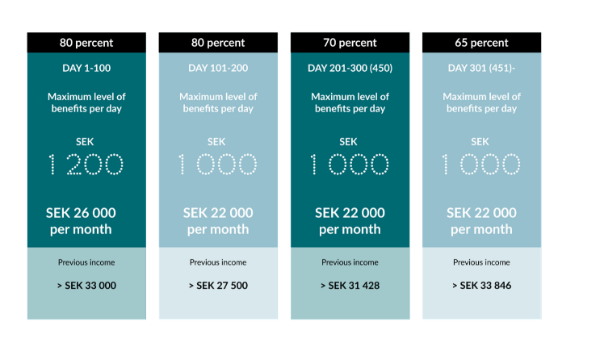

# The steps after you become unemployed from the PhD contract.

## University side

The university will help register your case in the Swedish Job Security Foundation, [Trygghetsstiftelsen](https://www.tsn.se/). Where you can get help from an assigned advisor. You can also update your profile in TSN and seek for some opportunities in their system.

## Public system side

On the first day of your unemployment, you need to register in the [arbetsförmedlingen](https://arbetsformedlingen.se/), where you also update your profile and fill in some information regarding your skills, the types of work you would like to do, etc. 

After you have registered in arbetsförmedlingen, you start applying for compensation from your unemployment insurance fund, which, in our case, is usually [Akademikernas a-kassa](https://www.akademikernasakassa.se/). Then in the system of Akademikernas a-kassa, you again need to update your profile and fill in some information. One special thing here is the employer certificate. On the university webpage, it is said like:

In my case, I already had no access to SSC Portal so I just call the number. Note that the call time is on **weekdays 09.00-12.00**. You can call them and give them your personal number, and asked them to issue that file for you. It usually is done very quickly. I got the file on the same day when I called them. However, in my case, this file was not sent directly to my email, but appeared in [Arbetsgivaringtyg](https://www.arbetsgivarintyg.nu/#/). You cannot download the certificate in that system. Rather, this certificate is automatically sent to your a-kassa, you go to a-kassa's My Pages and check the information shown on the certificate. If everything is correct, click submit.

In the a-kassa system, apart from updating your profile and confirming your employer certificate, you need to submit a weekly report during your unemployment period. Meanwhile, I was told by the operator to upload my PhD diploma in the system.

I was told it would take two to three weeks to evaluate the case and give the decision. 

The compensation from A-kassa works like below:

Thus, you only get 80% of 33 000 SEK of your salary for the first 100 days, and 80% of 27 500 SEK of your salary for the next 100 days. If you want the compensation to top-up to your original salary, you would need another insurance, which is usually from your union.

## Union side

There are many benefits when you are a member of a union, and income insurance is one among them. The income insurance from a union,  [SULF](https://sulf.se/en/) in my case, will help you top up the base 33 000 SEK to your original salary. This compensation is paid for a maximum of 150 days.

[The information for the steps to apply for compensation on SULF webpage](https://sulf.se/en/work-salary-and-benefits/unemployment/4-steps-if-you-become-unemployed/)

To apply for this supplemental compensation, you need to first have the decision from A-kassa and enclose that file with your application for compensation from your income insurance company, [Folksam](https://www.folksam.se/) in my case.

## Insurance company side

Combining the A-kassa and the union, you are entitled to get the 80% of your original salary, for a maximum of 150 days.

Then if you buy *Income insurance Voluntary supplement* in your insurance company, the benefits of compensation of 80% of your original salary can be extended to 300 days.

## Time line for my case

**Aug 29**: get the employer certificate.

**Sep 3**: submit the employer certificate in the A-kassa system.

**Sep 4**: upload my PhD diploma in the A-kassa system.

**Sep 8**: had a call with an arbetsförmedlingen staff who gave me some suggestions about the processes in job-seeking status. You need to:
* Submit job-application records (6 each month).
* If I want to take Swedish courses, I need to first get the approval from my a-kassa.
* Some useful links regarding training and job ads publishing.

